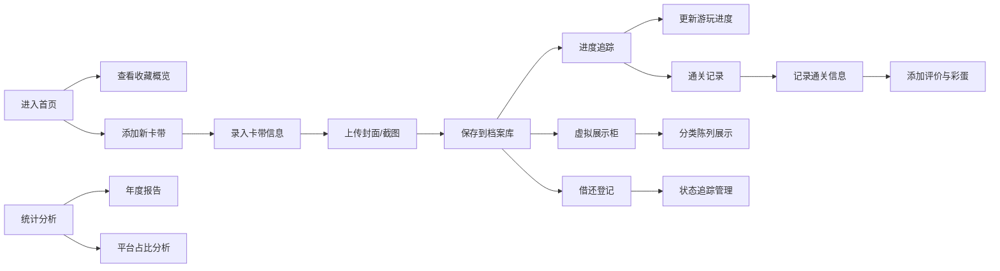

## 1. 产品概述

游戏卡带档案管理系统，专为复古游戏收藏家设计，帮助用户系统化管理游戏卡带收藏、记录通关历程、追踪游戏进度，并提供可视化的收藏展示与年度统计分析。

- 主要面向复古游戏爱好者、卡带收藏家，解决卡带信息零散、通关记录混乱、收藏管理不便的痛点
- 通过复古像素风格的 UI 设计，营造怀旧游戏氛围，提升收藏管理的趣味性与沉浸感

## 2. 核心功能

### 2.1 用户角色

| 角色 | 注册方式 | 核心权限 |
|------|----------|----------|
| 普通用户 | 本地使用（无需注册） | 完整的卡带管理、通关记录、统计分析功能 |

### 2.2 功能模块

1. **首页仪表盘**：卡带概览、快捷操作入口、收藏统计卡片
2. **卡带档案管理**：卡带信息录入、编辑、删除、多条件筛选查询
3. **通关记录中心**：通关日期、游玩时长、难度评分、结局类型管理
4. **游戏评价与彩蛋**：内容评价、剧情备注、彩蛋发现记录
5. **虚拟展示柜**：卡带分类陈列、自定义收藏展示
6. **进度与待玩**：游戏进度追踪、待玩清单管理
7. **统计分析**：年度游玩统计、平台占比分析、数据可视化图表
8. **借还管理**：卡带借出归还记录、状态追踪

### 2.3 页面详情

| 页面名称 | 模块名称 | 功能描述 |
|----------|----------|----------|
| 首页仪表盘 | 概览统计 | 卡带总数、已通关数、待玩数、本月新增卡片展示 |
| 首页仪表盘 | 快捷操作 | 快速添加卡带、添加通关记录、查看待玩清单入口 |
| 首页仪表盘 | 最近动态 | 最近添加的卡带、最近通关记录时间线展示 |
| 卡带档案 | 卡带列表 | 卡带卡片网格展示、分页、多条件筛选（平台、发行商、年份、品相） |
| 卡带档案 | 卡带详情 | 完整信息展示（平台、发行商、发行年份、品相、购买价格、封面图） |
| 卡带档案 | 卡带编辑 | 新增/编辑表单、封面图上传、游戏截图上传 |
| 通关记录 | 通关列表 | 按时间排序的通关记录、难度星级展示、结局类型标签 |
| 通关记录 | 通关详情 | 游玩时长、通关日期、难度评分、结局描述 |
| 游戏评价 | 评价列表 | 评分星星、内容评价、剧情备注、彩蛋记录 |
| 虚拟展示柜 | 分类陈列 | 按平台/收藏等级分类的展示架、像素风格卡带盒 |
| 虚拟展示柜 | 自定义布局 | 可拖拽调整展示位置、创建收藏主题 |
| 进度追踪 | 进度列表 | 正在游玩的游戏进度条、预计剩余时长 |
| 待玩清单 | 待玩管理 | 待玩游戏优先级、预计开始时间、标签分类 |
| 统计分析 | 年度报告 | 年度通关数量、游玩总时长、各月分布柱状图 |
| 统计分析 | 平台占比 | 各平台游戏数量饼图、发行商分布条形图 |
| 借还管理 | 借还记录 | 借出日期、预计归还日期、借用人、当前状态 |
| 借还管理 | 状态追踪 | 卡带借出/在库/逾期状态标签、归还操作 |

## 3. 核心流程

用户进入系统后，在首页查看收藏概览，可通过快捷操作添加新卡带，录入平台、发行商、年份、品相、购买价格等信息并上传封面图。

游玩过程中可在进度追踪模块更新游戏进度，通关后记录通关日期、游玩时长、难度评分和结局类型，并添加游戏评价和彩蛋发现记录。

可将卡带添加到虚拟展示柜进行分类陈列，创建个性化收藏主题。通过统计分析模块查看年度游玩报告和平台占比分析。卡带借出时登记借还记录，系统自动追踪归还状态。

## 4. 用户界面设计

### 4.1 设计风格

- **主色调**：霓虹蓝 `#00F0FF`、深灰 `#1A1A2E`、亮黄 `#FFD93D`
- **辅助色**：像素粉 `#FF6B9D`、像素绿 `#6BCB77`、像素橙 `#FF8C42`
- **背景**：深灰渐变背景 `#1A1A2E` → `#16213E`，叠加 8 位像素网格纹理
- **按钮风格**：8 位像素立体按钮，带像素边框和霓虹发光效果，悬停时有 CRT 扫描线动画
- **字体**：像素字体 "Press Start 2P" 用于标题和强调文字，"VT323" 用于正文内容
- **布局风格**：游戏卡带边框设计，像素化卡片组件，CRT 显示器扫描线滤镜效果
- **图标风格**：8 位像素风格图标，使用 emoji 和像素化 SVG 图标

### 4.2 页面设计概述

| 页面名称 | 模块名称 | UI 元素 |
|----------|----------|----------|
| 首页仪表盘 | 概览统计 | 像素风格数据卡片、霓虹发光数字、动画数字滚动效果 |
| 首页仪表盘 | 快捷操作 | 8 位游戏手柄按钮、悬停抖动动画、霓虹边框 |
| 首页仪表盘 | 最近动态 | 像素时间线、卡带缩略图、怀旧游戏字体 |
| 卡带档案 | 卡带列表 | 游戏卡带造型卡片网格、悬停插入动画、像素分页器 |
| 卡带档案 | 卡带详情 | 卡带盒 3D 翻转效果、游戏卡带标签设计、像素边框 |
| 通关记录 | 通关列表 | 难度星级像素图标、结局类型像素徽章、通关日期戳 |
| 虚拟展示柜 | 分类陈列 | 木质展示架纹理、卡带盒立体效果、霓虹灯带装饰 |
| 统计分析 | 图表 | 像素风格柱状图/饼图、霓虹配色、CRT 显示效果 |
| 借还管理 | 状态标签 | 像素风格状态徽章、逾期红色闪烁动画 |

### 4.3 响应式

- 采用桌面优先设计，在 1920px 宽度下达到最佳视觉效果
- 自适应 1280px、1024px 中等屏幕，卡片网格自动调整列数
- 移动端适配 768px 以下，转为单列布局，优化触控区域
- 所有像素元素在不同分辨率下保持锐利边缘，避免模糊

### 4.4 交互与动画

- 页面加载：像素化渐进显示效果，模拟老式游戏机启动画面
- 按钮交互：按下时有像素下沉效果，伴随 CRT 点击音效提示
- 卡片悬停：霓虹边框发光增强，轻微 3D 抬升，像素抖动动画
- 数据更新：数字滚动动画，类似街机游戏分数显示
- 页面切换：8 位像素横向/纵向过场动画
