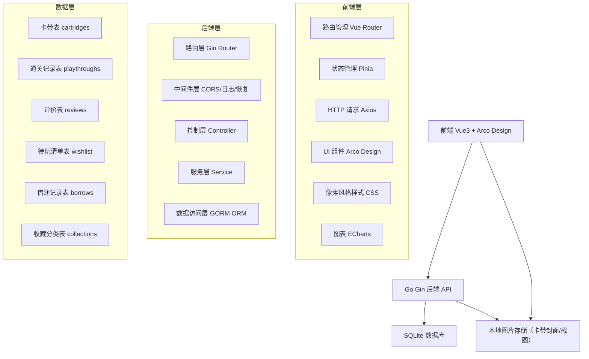
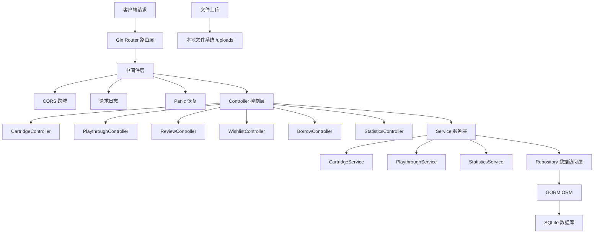
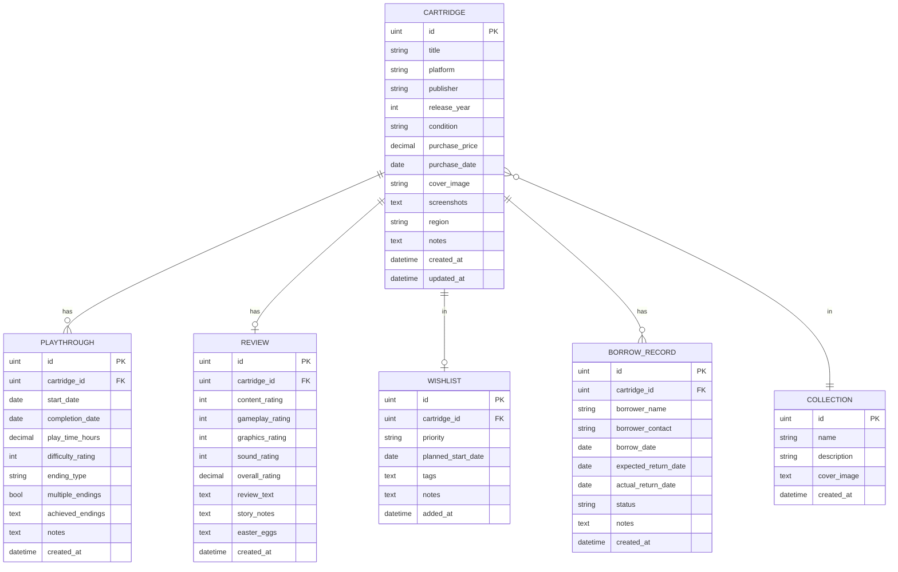

## 1. 架构设计



## 2. 技术描述

- **前端**：Vue 3.4 + TypeScript + Vite 5.0 + Pinia 状态管理 + Vue Router 4
- **UI 框架**：Arco Design Vue 2.x + 自定义像素风格 CSS 主题
- **图表库**：ECharts 5.x（像素风格定制）
- **HTTP 客户端**：Axios 1.6
- **初始化工具**：Vite 官方脚手架
- **后端**：Go 1.22 + Gin 1.9 + GORM 1.26
- **数据库**：SQLite 3 + GORM 自动迁移
- **图片存储**：本地文件系统，uploads 目录

## 3. 前端路由定义

| 路由 | 页面名称 | 说明 |
|------|----------|------|
| `/` | 首页仪表盘 | 收藏概览、快捷操作、最近动态 |
| `/cartridges` | 卡带档案列表 | 卡带网格展示、多条件筛选 |
| `/cartridges/:id` | 卡带详情页 | 卡带完整信息、通关记录、评价 |
| `/cartridges/new` | 新增卡带 | 卡带信息录入表单 |
| `/cartridges/:id/edit` | 编辑卡带 | 卡带信息编辑 |
| `/playthroughs` | 通关记录中心 | 通关记录列表、统计 |
| `/playthroughs/new` | 新增通关记录 | 通关信息录入 |
| `/progress` | 进度追踪 | 正在游玩进度、待玩清单 |
| `/wishlist` | 待玩清单 | 待玩游戏管理 |
| `/showcase` | 虚拟展示柜 | 卡带分类陈列展示 |
| `/statistics` | 统计分析 | 年度报告、平台占比图表 |
| `/borrows` | 借还管理 | 借还记录、状态追踪 |

## 4. API 接口定义

### 4.1 响应结构

```typescript
interface ApiResponse<T> {
  code: number;
  message: string;
  data: T;
}

interface PagedResponse<T> {
  items: T[];
  total: number;
  page: number;
  pageSize: number;
}
```

### 4.2 卡带管理接口

```typescript
// 卡带数据模型
interface Cartridge {
  id: number;
  title: string;
  platform: string;
  publisher: string;
  releaseYear: number;
  condition: 'mint' | 'excellent' | 'good' | 'fair' | 'poor';
  purchasePrice: number;
  purchaseDate: string;
  coverImage: string;
  screenshots: string[];
  region: string;
  notes: string;
  createdAt: string;
  updatedAt: string;
}

// 接口列表
GET    /api/cartridges              # 卡带列表（支持筛选、分页）
GET    /api/cartridges/:id          # 卡带详情
POST   /api/cartridges              # 新增卡带
PUT    /api/cartridges/:id          # 更新卡带
DELETE /api/cartridges/:id          # 删除卡带
POST   /api/cartridges/upload       # 上传卡带封面/截图
```

### 4.3 通关记录接口

```typescript
interface Playthrough {
  id: number;
  cartridgeId: number;
  startDate: string;
  completionDate: string;
  playTimeHours: number;
  difficultyRating: 1 | 2 | 3 | 4 | 5;
  endingType: string;
  multipleEndings: boolean;
  achievedEndings: string[];
  notes: string;
  createdAt: string;
}

GET    /api/playthroughs              # 通关记录列表
GET    /api/playthroughs/:id          # 通关详情
GET    /api/cartridges/:id/playthroughs  # 指定卡带的通关记录
POST   /api/playthroughs              # 新增通关记录
PUT    /api/playthroughs/:id          # 更新通关记录
DELETE /api/playthroughs/:id          # 删除通关记录
```

### 4.4 评价与彩蛋接口

```typescript
interface Review {
  id: number;
  cartridgeId: number;
  contentRating: 1 | 2 | 3 | 4 | 5;
  gameplayRating: 1 | 2 | 3 | 4 | 5;
  graphicsRating: 1 | 2 | 3 | 4 | 5;
  soundRating: 1 | 2 | 3 | 4 | 5;
  overallRating: number;
  reviewText: string;
  storyNotes: string;
  easterEggs: string[];
  createdAt: string;
}

GET    /api/reviews              # 评价列表
GET    /api/cartridges/:id/review  # 卡带评价详情
POST   /api/reviews              # 新增评价
PUT    /api/reviews/:id          # 更新评价
```

### 4.5 待玩清单接口

```typescript
interface WishlistItem {
  id: number;
  cartridgeId: number;
  priority: 'high' | 'medium' | 'low';
  plannedStartDate: string;
  tags: string[];
  notes: string;
  addedAt: string;
}

GET    /api/wishlist              # 待玩清单
POST   /api/wishlist              # 添加待玩
PUT    /api/wishlist/:id          # 更新待玩
DELETE /api/wishlist/:id          # 移除待玩
```

### 4.6 借还管理接口

```typescript
interface BorrowRecord {
  id: number;
  cartridgeId: number;
  borrowerName: string;
  borrowerContact: string;
  borrowDate: string;
  expectedReturnDate: string;
  actualReturnDate: string | null;
  status: 'borrowed' | 'returned' | 'overdue';
  notes: string;
  createdAt: string;
}

GET    /api/borrows              # 借还记录列表
GET    /api/borrows/:id          # 借还详情
POST   /api/borrows              # 登记借出
PUT    /api/borrows/:id          # 更新记录
PUT    /api/borrows/:id/return   # 标记归还
DELETE /api/borrows/:id          # 删除记录
```

### 4.7 统计分析接口

```typescript
GET /api/statistics/overview     # 概览统计（总数、已通关、待玩等）
GET /api/statistics/annual       # 年度统计（按月份统计通关数、时长）
GET /api/statistics/platforms    # 平台分布统计
GET /api/statistics/publishers   # 发行商分布统计
GET /api/statistics/conditions   # 品相分布统计
```

## 5. 后端服务架构



## 6. 数据模型

### 6.1 实体关系图



### 6.2 数据库初始化 DDL

```sql
-- 卡带表
CREATE TABLE cartridges (
  id INTEGER PRIMARY KEY AUTOINCREMENT,
  title TEXT NOT NULL,
  platform TEXT NOT NULL,
  publisher TEXT NOT NULL,
  release_year INTEGER,
  condition TEXT NOT NULL DEFAULT 'good',
  purchase_price REAL DEFAULT 0,
  purchase_date TEXT,
  cover_image TEXT,
  screenshots TEXT,
  region TEXT,
  notes TEXT,
  created_at DATETIME DEFAULT CURRENT_TIMESTAMP,
  updated_at DATETIME DEFAULT CURRENT_TIMESTAMP
);

CREATE INDEX idx_cartridges_platform ON cartridges(platform);
CREATE INDEX idx_cartridges_publisher ON cartridges(publisher);
CREATE INDEX idx_cartridges_year ON cartridges(release_year);
CREATE INDEX idx_cartridges_condition ON cartridges(condition);

-- 通关记录表
CREATE TABLE playthroughs (
  id INTEGER PRIMARY KEY AUTOINCREMENT,
  cartridge_id INTEGER NOT NULL,
  start_date TEXT,
  completion_date TEXT NOT NULL,
  play_time_hours REAL DEFAULT 0,
  difficulty_rating INTEGER NOT NULL DEFAULT 3,
  ending_type TEXT,
  multiple_endings INTEGER DEFAULT 0,
  achieved_endings TEXT,
  notes TEXT,
  created_at DATETIME DEFAULT CURRENT_TIMESTAMP,
  FOREIGN KEY (cartridge_id) REFERENCES cartridges(id) ON DELETE CASCADE
);

CREATE INDEX idx_playthroughs_cartridge ON playthroughs(cartridge_id);
CREATE INDEX idx_playthroughs_date ON playthroughs(completion_date);

-- 评价表
CREATE TABLE reviews (
  id INTEGER PRIMARY KEY AUTOINCREMENT,
  cartridge_id INTEGER NOT NULL UNIQUE,
  content_rating INTEGER NOT NULL DEFAULT 3,
  gameplay_rating INTEGER NOT NULL DEFAULT 3,
  graphics_rating INTEGER NOT NULL DEFAULT 3,
  sound_rating INTEGER NOT NULL DEFAULT 3,
  overall_rating REAL NOT NULL DEFAULT 3,
  review_text TEXT,
  story_notes TEXT,
  easter_eggs TEXT,
  created_at DATETIME DEFAULT CURRENT_TIMESTAMP,
  FOREIGN KEY (cartridge_id) REFERENCES cartridges(id) ON DELETE CASCADE
);

-- 待玩清单表
CREATE TABLE wishlist (
  id INTEGER PRIMARY KEY AUTOINCREMENT,
  cartridge_id INTEGER NOT NULL,
  priority TEXT NOT NULL DEFAULT 'medium',
  planned_start_date TEXT,
  tags TEXT,
  notes TEXT,
  added_at DATETIME DEFAULT CURRENT_TIMESTAMP,
  FOREIGN KEY (cartridge_id) REFERENCES cartridges(id) ON DELETE CASCADE
);

-- 借还记录表
CREATE TABLE borrow_records (
  id INTEGER PRIMARY KEY AUTOINCREMENT,
  cartridge_id INTEGER NOT NULL,
  borrower_name TEXT NOT NULL,
  borrower_contact TEXT,
  borrow_date TEXT NOT NULL,
  expected_return_date TEXT,
  actual_return_date TEXT,
  status TEXT NOT NULL DEFAULT 'borrowed',
  notes TEXT,
  created_at DATETIME DEFAULT CURRENT_TIMESTAMP,
  FOREIGN KEY (cartridge_id) REFERENCES cartridges(id) ON DELETE CASCADE
);

CREATE INDEX idx_borrows_status ON borrow_records(status);
CREATE INDEX idx_borrows_cartridge ON borrow_records(cartridge_id);

-- 收藏分类表
CREATE TABLE collections (
  id INTEGER PRIMARY KEY AUTOINCREMENT,
  name TEXT NOT NULL,
  description TEXT,
  cover_image TEXT,
  created_at DATETIME DEFAULT CURRENT_TIMESTAMP
);

-- 收藏分类关联表
CREATE TABLE cartridge_collections (
  cartridge_id INTEGER NOT NULL,
  collection_id INTEGER NOT NULL,
  created_at DATETIME DEFAULT CURRENT_TIMESTAMP,
  PRIMARY KEY (cartridge_id, collection_id),
  FOREIGN KEY (cartridge_id) REFERENCES cartridges(id) ON DELETE CASCADE,
  FOREIGN KEY (collection_id) REFERENCES collections(id) ON DELETE CASCADE
);
```

### 6.3 示例初始化数据

```sql
-- 示例卡带数据
INSERT INTO cartridges (title, platform, publisher, release_year, condition, purchase_price, purchase_date, region, notes) VALUES
('超级马里奥兄弟', 'NES', '任天堂', 1985, 'excellent', 128.50, '2023-03-15', '日版', '经典初代，保存完好'),
('塞尔达传说 时之笛', 'N64', '任天堂', 1998, 'mint', 350.00, '2022-08-20', '美版', '全新未拆封收藏'),
('最终幻想7', 'PS1', '史克威尔', 1997, 'good', 88.00, '2023-01-10', '日版', '双碟装，说明书齐全'),
('索尼克大冒险', 'DC', '世嘉', 1998, 'fair', 45.00, '2023-05-01', '日版', '外壳有轻微划痕');

-- 示例通关记录
INSERT INTO playthroughs (cartridge_id, start_date, completion_date, play_time_hours, difficulty_rating, ending_type, multiple_endings, notes) VALUES
(1, '2024-01-05', '2024-01-12', 8.5, 2, '标准结局', 0, '重温童年经典'),
(3, '2024-02-01', '2024-03-15', 60.0, 4, 'A结局', 1, '终于达成A结局，下次尝试其他路线');

-- 示例评价
INSERT INTO reviews (cartridge_id, content_rating, gameplay_rating, graphics_rating, sound_rating, overall_rating, review_text, easter_eggs) VALUES
(1, 5, 5, 4, 5, 4.8, '永远的经典，每次玩都有新感受', '负一关、跳关秘籍'),
(3, 5, 5, 5, 5, 5.0, 'RPG史上的里程碑，爱丽丝之死至今难忘', '萨菲罗斯彩蛋、隐藏召唤兽');

-- 示例待玩清单
INSERT INTO wishlist (cartridge_id, priority, planned_start_date, tags, notes) VALUES
(2, 'high', '2024-06-01', '神作,必玩', '听说这是最好的塞尔达'),
(4, 'medium', NULL, '世嘉,怀旧', '世嘉粉丝必玩');
```
